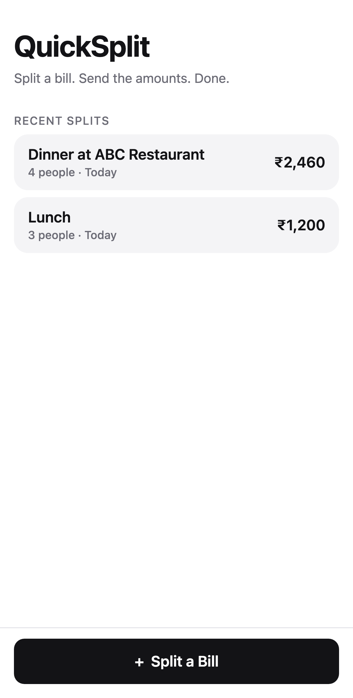
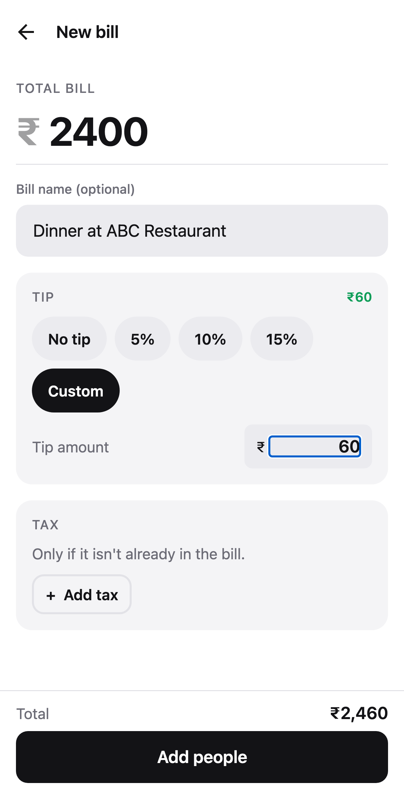
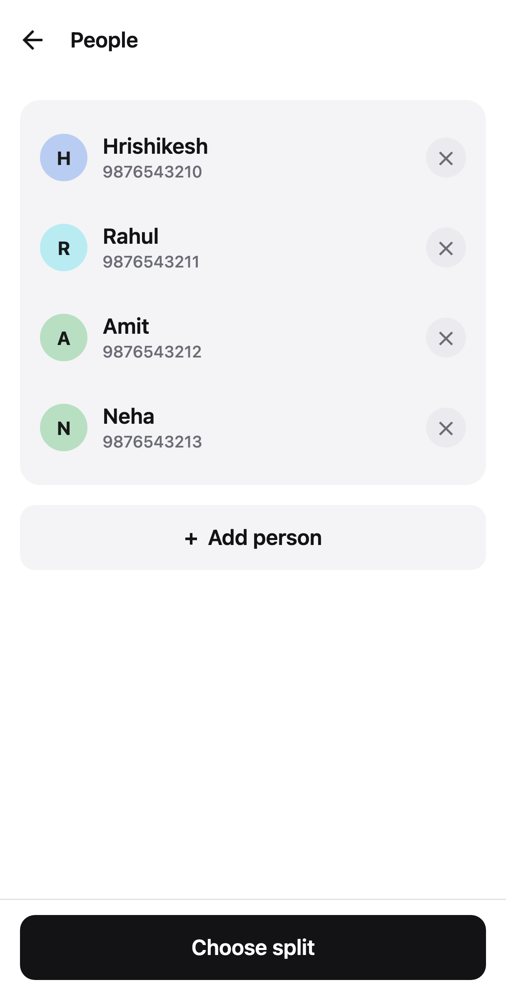
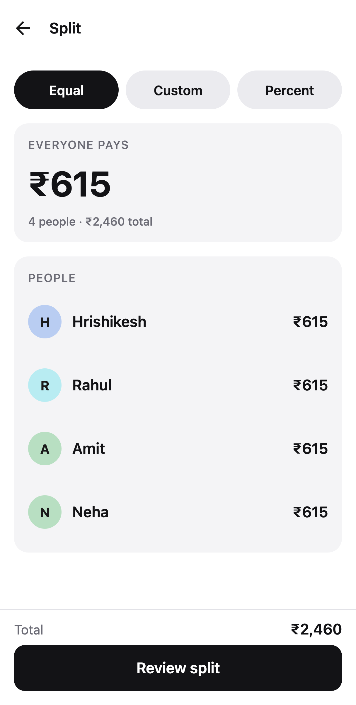
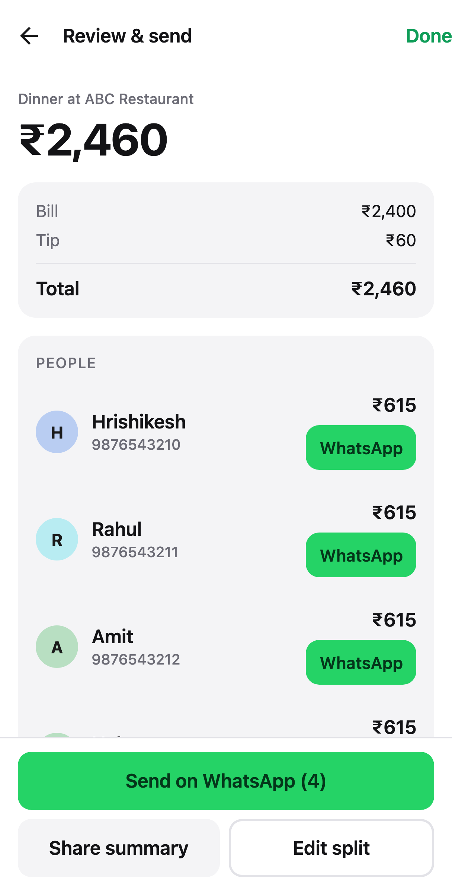

# VaatUp

**Split expenses. Track who owes what. Send everyone's share on WhatsApp.**

VaatUp starts from one question — _"I just paid the bill, how fast can I tell everyone what they owe me?"_ — and keeps the answer afterwards. Type the amount, add the people, send each of them their share, and the app remembers the balance until somebody settles it. Everything, including your account, lives on your device: no backend, no analytics, nothing uploaded.

## Features

**Splitting**

- **Four ways to split** — equally, by exact amount, by percentage, or by shares (one person eats two portions, one eats one)
- **Several payers** — when two people put a card down, each person's share is owed back in proportion to what each payer put in
- **Tip and tax** — no tip, 5% / 10% / 15%, or a flat amount, plus tax when it isn't in the printed bill
- **Exact rounding everywhere** — ₹1,000 across 3 people is ₹333.34 / ₹333.33 / ₹333.33, and the shares always add back up to the total

**Keeping track**

- **Balances** — what you are owed and what you owe, overall and person by person
- **Fewest payments** — a group of four owing each other in circles usually clears in two transfers, and the app works out which two
- **Settle up** — record a payment in either direction, in part or in full, and tell the other person on WhatsApp
- **History** — every expense, searchable and filterable by group, category, and date, grouped by the day it was spent
- **Groups** — a trip or a flat, with its own balances
- **People** — anyone you split with, saved as you go; nobody else needs the app installed
- **Details on an expense** — category, notes, comments, a photo of the receipt, and itemised lines
- **Repeating expenses** — rent or a shared subscription, added when it comes due

**Sending**

- **WhatsApp message generation** — one tailored message per person, for a share or a settlement
- **Native sharing** — plain-text summary for groups, Telegram, SMS, or email
- **UPI collect** — add your own UPI ID and each share can be asked for by exact amount, either as a line in the message or as a QR code your friends scan at the table

## Screenshots

| Home | New bill | People |
| --- | --- | --- |
|  |  |  |

| Split | Review & send |
| --- | --- |
|  |  |

## How the WhatsApp behaviour works

> VaatUp generates a personalised message and opens WhatsApp with it pre-filled. **You review the message and press send yourself.**

Nothing is ever sent in the background. There is no scraping, no unofficial API, no WhatsApp Web automation, no credential handling, and no access to your contacts. `Send all` simply walks the list one person at a time — you send each message manually inside WhatsApp.

If WhatsApp can't be opened (for example it isn't installed), the app falls back to the `wa.me` universal link, and offers the native share sheet as a last resort.

Message format:

```text
Hey Rahul 👋

Here's the split for Dinner at ABC Restaurant:

Total bill: ₹2,460
(Bill ₹2,400 + Tip ₹60)
People: 4

💰 Your share: ₹615

Split:
Hrishikesh: ₹615
Rahul: ₹615
Amit: ₹615
Neha: ₹615

Thanks!
— VaatUp
```

## How UPI collect works

> VaatUp is not a payment app. It writes a standard `upi://pay` request naming you and the amount; the payer's own bank app does the rest.

Add your UPI ID once under **Payment details** and two things become available:

- **In the message** — one extra line, `💸 Pay ₹492 to asha@okhdfcbank (any UPI app)`, addressed with that person's own share and left out entirely for anyone already marked paid. Deliberately plain text, because chat clients don't reliably make a `upi://` link tappable, while a UPI ID is always something the payer can paste into their app.
- **As a QR code** — the **QR** button next to a share opens a code encoding that exact amount. Scanning it in any UPI app pre-fills the payee and the amount, which is the fastest route at a table and the only one that needs no phone number at all.

Your UPI ID is stored on the device and nowhere else. There is no payment SDK, no bank credential, and no network call: `utils/upi.ts` is pure string building, and `supportsUpi()` keeps the feature to INR, which is the only currency the UPI URI is defined for.

## Architecture

React Native + TypeScript on Expo, with Expo Router for navigation and SQLite for storage. The app is local-first: an account is created and checked on the device, and every expense, person, group, settlement, and receipt is written to a local database. There is no backend — but the seams for one are already in place, which is why reads and writes go through repository interfaces rather than SQL in a screen.

```text
src/
  app/                     Routes (Expo Router — every file is a screen)
    _layout.tsx            Providers, the auth gate, and the root stack
    (auth)/login.tsx       Sign in
    (auth)/register.tsx    Create a local account
    (tabs)/index.tsx       Home: balances and recent activity
    (tabs)/expenses.tsx    History with search and filters
    (tabs)/groups.tsx      Groups
    (tabs)/friends.tsx     People you split with
    (tabs)/profile.tsx     Your name, number, and settings
    bill/create.tsx        Amount, name, tip, tax, category, group, notes, receipt
    bill/people.tsx        Add / edit / remove people
    bill/split.tsx         Who paid, and Equal | Exact | Percent | Shares
    bill/result.tsx        Summary, per-person WhatsApp, share, edit
    bill/qr.tsx            Modal: UPI QR for one person's share
    expense/[id].tsx       One expense: payers, shares, comments, receipt
    group/new.tsx  group/[id].tsx   Create a group; a group's balances
    friend/edit.tsx        Add or edit a person
    balances.tsx           Every balance, and the fewest payments to clear them
    settle.tsx             Record a payment
    recurring.tsx          Repeating expenses
    settings.tsx           Payment details: your UPI ID
  application/             Use cases — the only way the UI reaches data
    auth-service.ts  expense-service.ts  balance-service.ts
    settlement-service.ts  people-service.ts  comment-service.ts
    recurring-service.ts  whatsapp-share-service.ts
  domain/                  Pure business rules
    balance.ts             The balance engine, derived from records
    debt-simplification.ts Fewest payments that clear a set of balances
    errors.ts              Application-level error types
  repositories/
    types.ts               One interface per aggregate
    sqlite/                The implementations in use today
    local-auth-repository.ts
    index.ts               Where implementations are chosen (swap point for an API)
  database/
    database.ts            The narrow port the repositories talk to
    sqlite-database.ts     expo-sqlite driver behind that port
    migrations/            Numbered, append-only schema changes
  hooks/
    use-async.ts           Load, error, and reload for one query
    use-data.ts            One hook per thing a screen needs
  state/
    session.tsx            Who is signed in
    bill-draft.tsx         The expense being built, persisted only on commit
    refresh.tsx            Revision counter that reloads reads after a write
  components/              Presentational UI only
  storage/
    session.ts             The active user id (a token would go here later)
    collector.ts           Your own UPI ID, on this device only
  theme/
    theme.ts               Every colour, size, type style, and motion value
  types/                   The domain model
  utils/                   Pure helpers (calculations, currency, phone, upi, …)
__tests__/                 Unit tests for the money, the balances, and the utilities
```

A few decisions are worth calling out:

**Balances are derived, never stored.** `domain/balance.ts` recomputes them from expenses and settlements every time, so a balance cannot drift out of step with its own history. It is a pure function over rows, which is also what makes it cheap to test exhaustively.

**Reads and writes are separated from storage by two layers.** A screen calls a hook, a hook calls a service, a service calls a repository interface, and only `repositories/index.ts` knows those interfaces are backed by SQLite. Adding a server later means writing a second set of implementations and changing that one file.

**Deletes are soft and migrations are append-only.** Every table carries `deleted_at` and every query filters on it, so a mistaken delete is recoverable and a future sync has something to reconcile.

**Money is always an integer number of minor units** (paise). Rupee floats cannot guarantee that three shares add back up to the total, so every amount in the app is an integer and formatting happens only at the edge, in `utils/currency.ts`. Adding another currency means adding a `Currency` record — nothing downstream changes.

**Splitting uses the largest-remainder method.** `roundSplitAmounts()` floors every share, then hands the leftover paise to the largest remainders. The sum of the shares therefore always equals the total, exactly, for any amount and any number of people.

**`theme/theme.ts` is the only file with a hex colour or a raw pixel value.** Text styles come from `typography` (each one a size *and* a line height), tappable heights from `control`, state fades from `opacity`, strokes from `borderWidth`, press feedback from `motion`. `__tests__/theme.test.ts` then asserts the palette against WCAG: every foreground is checked at 4.5:1 against every surface it can appear on, in both themes, so adding a colour that fails contrast breaks the build rather than shipping.

**Business logic is free of React Native.** `utils/calculations.ts`, `domain/`, and the message builders import nothing from the UI, so they are unit-testable and reusable — which is also what makes the roadmap below additive rather than a rewrite.

## Installation

Requires Node 20+ and the Expo Go app (or a simulator).

```bash
git clone <repo-url>
cd VaatUp
npm install
```

## Development

```bash
npm start          # start the dev server, then press i / a, or scan the QR code
npm run ios        # open in the iOS simulator
npm run android    # open in an Android emulator
npm run web        # run in a browser
npm run lint       # ESLint
npm run typecheck  # tsc --noEmit
```

The app runs in Expo Go — every dependency is part of the Expo Go runtime, so no custom development build is needed. `android/` and `ios/` are generated on demand (`npx expo prebuild`) and are not checked in.

`npm run web` works too, and is how the flows are checked end to end in a browser. `expo-sqlite`'s web build is alpha: it needs the WebAssembly and COOP/COEP setup in `metro.config.js`, cannot be statically rendered (hence `web.output: "single"`), and has no exclusive transactions, so the driver falls back to a plain one there.

WhatsApp deep links only work on a real device with WhatsApp installed. On iOS, `whatsapp` is declared in `LSApplicationQueriesSchemes` in `app.json` so the app can detect it.

## Testing

```bash
npm test              # run all tests
npm run test:watch    # watch mode
```

The suite focuses on the parts where correctness matters and UI cannot help you: the calculation engine, the balance engine, debt simplification, currency formatting and parsing, phone normalisation, validation rules, and message generation. WhatsApp message building is tested separately from opening WhatsApp — the deep-link opener is tested against a mocked `expo-linking`.

Cases covered include `1000 / 2`, `1000 / 3`, `1001 / 3`, a balanced exact split and an unbalanced one with its remaining amount, `50 + 30 + 20 = 100` and `50 + 30 + 30 = 110`, a 2:1:1 shares split, payments that do not add up to the total, a share divided between two payers, debts that run both ways cancelling out, a settlement pushing a balance past zero, and a circular debt between three people clearing in two payments. Two invariants are asserted directly: balances always net to zero across everyone, and simplification never moves more money than is owed.

## Releasing

```bash
npx eas-cli@latest build --platform android --profile production   # signed .aab
npx eas-cli@latest submit --platform android --profile production --latest
```

`eas.json` defines three profiles — `development` (dev client), `preview` (installable APK for device testing), and `production` (Play-ready app bundle with an auto-incrementing `versionCode`). The Android build declares `INTERNET` and `VIBRATE` (for haptic feedback, a normal permission that never prompts); storage and overlay permissions that arrive through native manifest merging are stripped in `app.json` via `blockedPermissions`, so the app requests no runtime permissions at all.

[docs/PLAY_STORE_RELEASE.md](docs/PLAY_STORE_RELEASE.md) is the full walkthrough — keystore handling, the Play Console forms, store listing copy, and the Data Safety answers. Ready-made listing assets live in [docs/store/](docs/store), along with a privacy policy you can publish as-is.

## Contributing

1. Keep business logic in `utils/` and `domain/` as pure functions, keep `components/` presentational, and reach data only through `application/`.
2. Add or update a test for any change to the money, the balances, validation, or message format.
3. Run `npm run lint`, `npm run typecheck`, and `npm test` before opening a PR.
4. Don't add a dependency without a clear reason — this app is deliberately small. Use `npx expo install` so versions stay SDK-compatible.
5. Follow the existing file naming (kebab-case) and the tokens in `theme/theme.ts` rather than hard-coded colours or spacing.

## Roadmap

- **Read the receipt** — photograph the bill and read the items off it, instead of typing them
- **Sync, if it is ever wanted** — the repository interfaces and soft deletes exist so this can be added without touching a screen
- **Official WhatsApp Business integration**, behind the same message builders

Explicitly **not** planned: ads, trackers, spending analytics sold back to you, social features, or automatic message sending.

## License

MIT — see [LICENSE](LICENSE).
